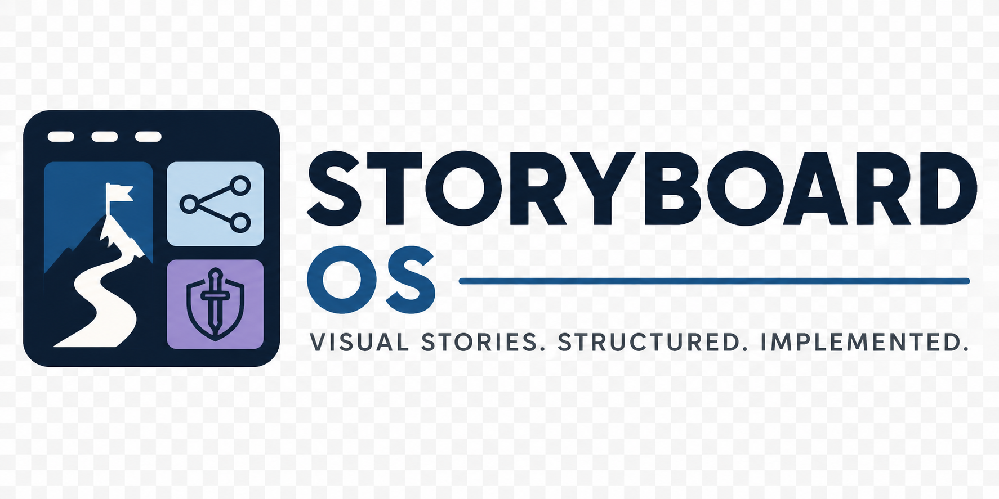

<p align="center">
  
</p>

<p align="center"><strong>Visual stories. Structured. Implemented.</strong></p>

---

# Storyboard OS

A visual story-structure authoring platform for interactive narrative — quests, branches, scenes, encounters, consequences, and the game-state logic that connects them.

**rpg-storyboard** is the first vertical: a game-authoring tool for RPG video game quest and scene design. It is not a demo or a prototype. It is the product this platform was built to run.

---

## What Storyboard OS Is

A structured board for designing **implementable narrative**. Every frame on the canvas is a beat with:
- Entry and exit conditions
- State changes (flags, variables, world-state)
- Required assets for the production pass
- Test criteria with pass/fail checks
- Implementation checklist

The board visualizes game-state flow, not just story sequence. Connections carry meaning — choice branches, consequence arcs, sequence spines, fallback paths. A designer can read the board and understand what the game actually does.

## What Storyboard OS Is Not

- A generic diagramming or whiteboard tool
- A session runner or GM aid
- A worldbuilding wiki or lore database
- A dialogue-tree-only editor
- A campaign prep app

If a reader could mistake this for any of those, the product has drifted.

---

## What rpg-storyboard Does (Phase 1)

After Phase 1, a designer can:

| Capability | What they get |
|---|---|
| **Visual board** | Quest flow and game-state branch logic side by side on a Konva canvas |
| **Game-state signal** | Per-frame badges (STATE, SPEC/PARTIAL/DRAFT) without leaving the board |
| **Implementation readiness** | Each beat shows READY/PARTIAL/DRAFT/BLOCKED status + what's missing |
| **Quest handoff** | One-click Markdown + JSON export ordered by topological beat sequence |
| **Templates** | Three RPG production starting points with beat-type sequences and rationale |
| **Board operations** | Zoom, pan, fit-to-board, reset, keyboard shortcuts — laptop-usable navigation |

The board is an operating surface. The beat inspector is an implementation spec. The handoff is a document a developer can build from.

---

## Packages

| Package | What it owns |
|---|---|
| `@storyboard-os/core` | Generic storyboard primitives: frame, connection, annotation, template, structural validator. No domain vocabulary. |
| `@storyboard-os/rpg-domain` | RPG game-authoring contract: frame types, content fields, templates, readiness model, handoff generator, Tollhouse Ledger demo quest. |
| `@storyboard-os/canvas` | Konva canvas renderer: frames, connections, selection, drag, type badges, connection labels, zoom/pan viewport. Domain config passed in. |
| `@storyboard-os/routing` | Configurable URL helpers: board and frame route generation. No dependencies. |

## Apps

| App | What it is |
|---|---|
| `rpg-storyboard` | Astro RPG game-authoring product. Owns: RPG canvas config, frame inspector, handoff pages, template gallery, route setup, page layout. |

---

## Architecture

The packages form a clean dependency chain:

```
apps/rpg-storyboard
  → @storyboard-os/rpg-domain  (RPG game-authoring contract)
  → @storyboard-os/canvas      (Konva renderer, domain-configurable)
  → @storyboard-os/routing     (URL helpers)

@storyboard-os/rpg-domain
  → @storyboard-os/core        (generic primitives)

@storyboard-os/canvas
  → (no platform deps — pure Konva + React)

@storyboard-os/routing
  → (no deps — pure string helpers)

@storyboard-os/core
  → (no deps)
```

A second vertical (e.g. `apps/screenplay-storyboard`) would create its own domain package and reuse `@storyboard-os/core`, `@storyboard-os/canvas`, and `@storyboard-os/routing` without touching `@storyboard-os/rpg-domain`.

See [`docs/architecture.md`](docs/architecture.md) for full detail.

---

## Quick Start

```bash
pnpm install
pnpm dev        # starts rpg-storyboard at localhost:4321
pnpm test       # runs all package + app tests (295 tests)
pnpm build      # builds rpg-storyboard (38 pages)
```

Requirements: Node ≥ 20, pnpm ≥ 9.

Test scope is automatically filtered to `@storyboard-os/*` packages and `rpg-storyboard` — it does not pick up sibling workspaces in the parent directory.

---

## Status

```
Phase 1 complete
295/295 tests passing
38/38 pages built
```

| Phase | Description | Status |
|---|---|---|
| 0A–0F | RPG authoring proof — canvas, beat pages, templates, demo quest | ✅ |
| 0R | Repair + re-anchor — every frame carries game-state spec | ✅ |
| 0M | Monorepo migration — core, domain, canvas, routing extracted | ✅ |
| 1A | Branch + state visibility on the canvas | ✅ |
| 1B | Implementation readiness per beat | ✅ |
| 1C | Quest handoff export | ✅ |
| 1D | Template gallery | ✅ |
| 1E | Board operations — zoom, pan, fit, viewport controls | ✅ |
| 1F | Release closeout — docs, changelog, architecture notes | ✅ |

---

## Demo

**The Tollhouse Ledger** — three factions want the same hidden ledger. The player decides who wins, who loses, and what the region looks like next. Eight beats with complete game-state spec: flag names, asset requirements, pass/fail test criteria, implementation checklists.

Every frame in the demo is implementable as a quest in an RPG engine without supplementary documentation.

Route: `/storyboards/quest-01`

---

## Docs

- [`docs/architecture.md`](docs/architecture.md) — package separation, dependency rules, canvas viewport model, extensibility
- [`docs/product-brief.md`](docs/product-brief.md) — what rpg-storyboard is, target user, drift warnings, acceptance gates
- [`docs/rpg-storyboard.md`](docs/rpg-storyboard.md) — RPG game-authoring contract, authoring loop, readiness model, handoff export
- [`docs/phase-0-closeout.md`](docs/phase-0-closeout.md) — Phase 0 dogfood verdict and original Phase 1 backlog
- [`docs/phase-1-closeout.md`](docs/phase-1-closeout.md) — Phase 1 spine narrative and architecture integrity record
- [`docs/monorepo-migration.md`](docs/monorepo-migration.md) — 0M migration log: what moved, why, and the resulting architecture
- [`CHANGELOG.md`](CHANGELOG.md) — release history
